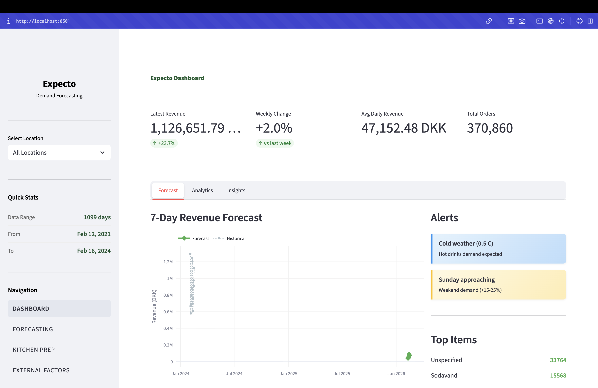
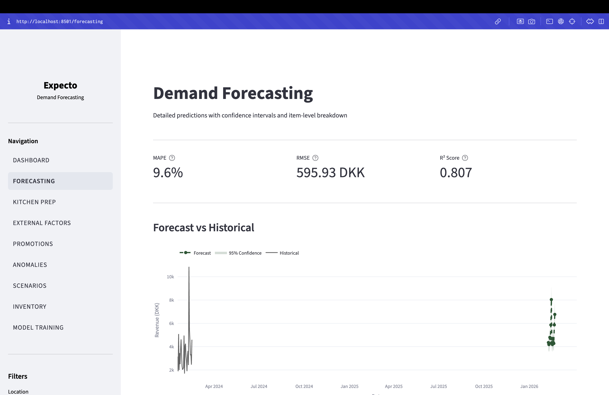
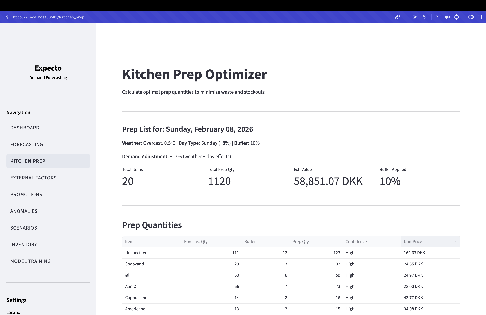
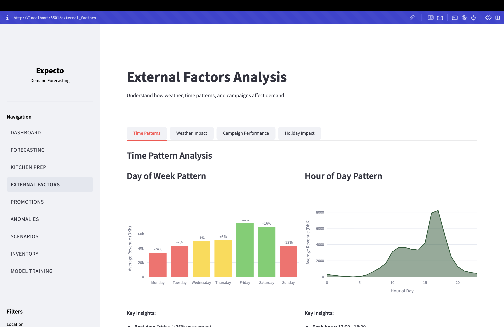
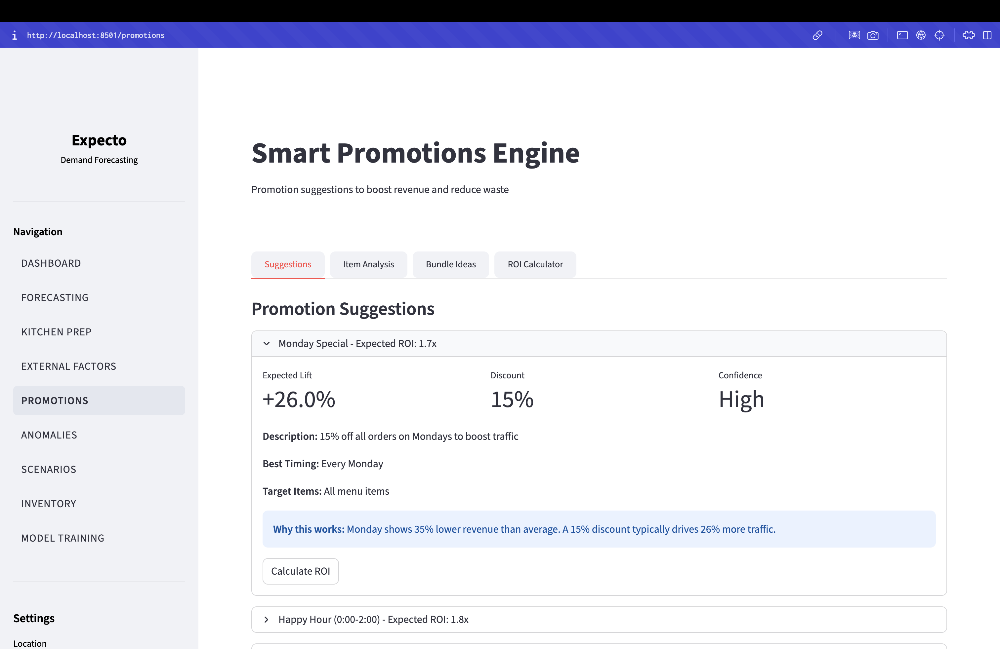
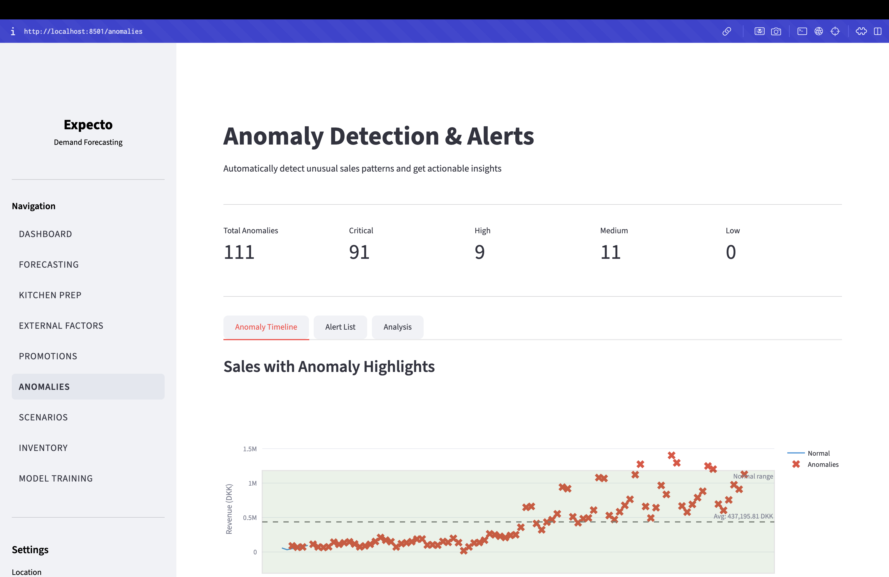
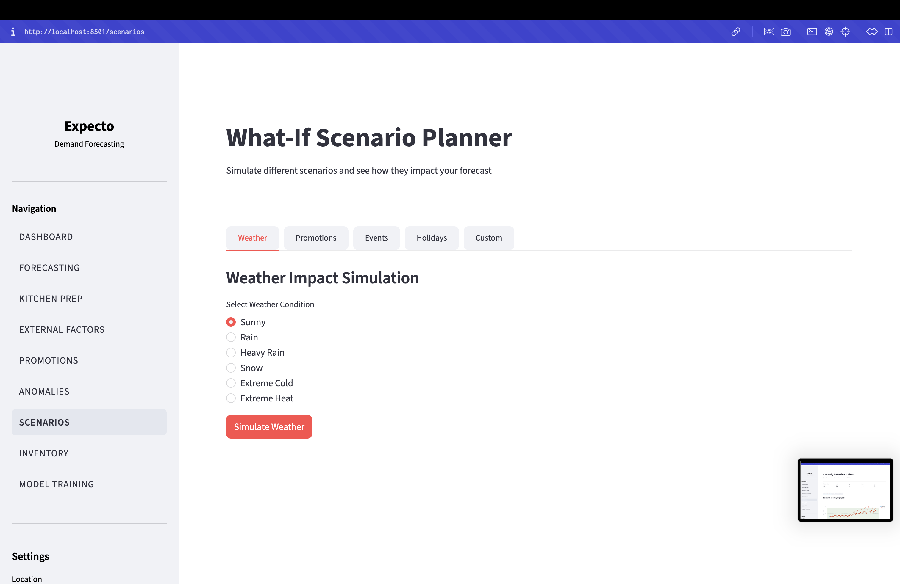
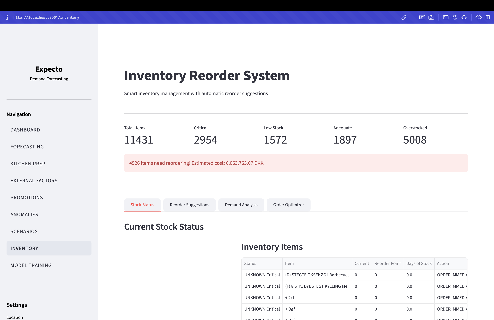
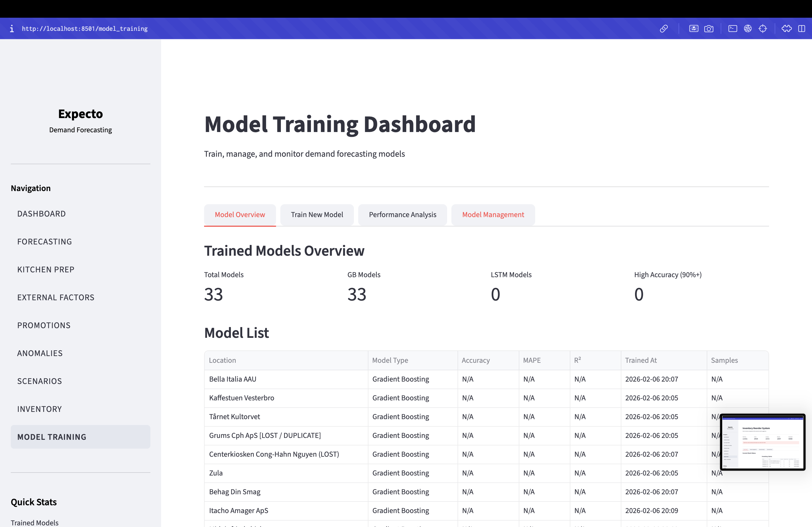

# Expecto

**Expecto** is a demand forecasting and inventory optimization platform built for the restaurant and grocery industry. It tackles the core challenge of balancing stock levels: over-stocking leads to waste and spoiled inventory, while under-stocking causes stockouts, lost revenue, and frustrated customers. Expecto replaces guesswork with data-driven predictions powered by machine learning, enabling businesses to forecast demand accurately, optimize kitchen prep, detect anomalies, and manage inventory efficiently.

Built for the **Deloitte x AUC Hackathon** - Inventory Management use case (Fresh Flow Markets).

---

## Features

### 1. Dashboard
The main dashboard provides a real-time overview of business performance with key KPIs (latest revenue, weekly change, average daily revenue, total orders), a 7-day revenue forecast chart with confidence intervals, weather-based alerts, and a top-selling items summary.



### 2. Demand Forecasting
Detailed demand predictions at both the revenue and item level. Supports configurable forecast horizons (7-30 days) with daily, weekly, or monthly granularity. Displays model accuracy metrics (MAPE, RMSE, R2) and provides a daily forecast breakdown with item-level quantities. Includes CSV export for integration with external systems.



### 3. Kitchen Prep Optimizer
Calculates optimal daily prep quantities to minimize food waste. Automatically adjusts for weather conditions, day-of-week patterns, and configurable safety buffers (5-25%). Outputs a printable prep list with confidence levels and historical accuracy tracking.



### 4. External Factors Analysis
Analyzes how external variables impact sales performance:
- **Time Patterns**: Day-of-week demand curves, hourly patterns, monthly seasonality
- **Weather Impact**: Temperature and precipitation correlation with revenue
- **Campaign Performance**: Active campaign tracking with lift metrics by campaign type
- **Holiday Impact**: Danish holiday calendar with historical impact analysis



### 5. Promotions Engine
Generates data-driven promotion suggestions with ROI predictions. Features a BCG-style item performance matrix (Stars, Cash Cows, Question Marks, Dogs), bundle opportunity detection via co-occurrence analysis, and an interactive ROI calculator for evaluating custom discount strategies.



### 6. Anomaly Detection
Automatically identifies unusual sales patterns using statistical methods (Z-score deviation, day-of-week analysis, trend change detection). Each anomaly includes severity classification (Critical/High/Medium/Low), possible root causes, and recommended corrective actions. Configurable sensitivity and lookback period.



### 7. What-If Scenario Planner
Simulates the revenue and order impact of different scenarios before they happen:
- **Weather**: Sunny, rain, heavy rain, snow, extreme temperatures
- **Promotions**: Discount percentages, BOGO, free delivery, loyalty point multipliers
- **Local Events**: Festivals, sports events, concerts, competitor closures
- **Holidays**: Christmas, Easter, Midsummer, and other Danish holidays
- **Custom**: Build custom scenarios with adjustable revenue/order multipliers



### 8. Inventory Reorder System
Manages stock levels with automatic reorder point calculations using safety stock formulas. Tracks stock status (Critical/Low/Adequate/Overstocked), generates prioritized reorder suggestions, analyzes demand variability, and provides budget-constrained order optimization. Configurable lead time and service level (90%, 95%, 99%).



### 9. Model Training Dashboard
Train, monitor, and manage machine learning models directly from the UI. View accuracy metrics across all locations, train new Gradient Boosting models for locations with sufficient data (60+ days), compare performance across locations, and retrain or export model reports.



---

## Technologies Used

| Category | Technology | Purpose |
|----------|-----------|---------|
| **Web Framework** | Streamlit | Interactive dashboard and UI |
| **Machine Learning** | scikit-learn | Gradient Boosting demand forecasting |
| **Deep Learning** | PyTorch | LSTM neural network for time-series prediction |
| **Data Processing** | pandas, NumPy | Data manipulation and numerical computing |
| **Statistical Analysis** | SciPy | Anomaly detection (Z-score analysis) |
| **Visualization** | Plotly | Interactive charts and graphs |
| **Visualization** | Matplotlib, Seaborn | Statistical plots |
| **Weather API** | Open-Meteo | Real-time and historical weather data (free, no API key) |
| **Holiday Data** | holidays (Python) | Danish holiday calendar |
| **HTTP** | Requests | External API communication |
| **Testing** | pytest | Unit and integration testing |

---

## Installation

### Prerequisites
- Python 3.8 or higher
- pip package manager

### Steps

1. **Clone the repository**
   ```bash
   git clone https://github.com/ahmedmgh67/DIH-X-AUC-Hackathon.git
   cd DIH-X-AUC-Hackathon
   ```

2. **Download the dataset**

   Download **inventory-management.zip** from the [GitHub Releases page](https://github.com/ynakhla/DIH-X-AUC-Hackathon/releases/tag/v1.0-data) and extract it into the `data/` directory:
   ```
   data/
   └── Inventory Management/
       ├── fct_orders.csv
       ├── fct_order_items.csv
       ├── dim_menu_items.csv
       ├── dim_places.csv
       ├── dim_campaigns.csv
       └── fct_campaigns.csv
   ```

3. **Install dependencies**
   ```bash
   pip install -r requirements.txt
   ```

4. **Run the application**
   ```bash
   cd src/freshflow
   streamlit run app.py
   ```

5. **Access the dashboard** at `http://localhost:8501`

---

## Usage

### Getting Started
1. Open the dashboard - the main page shows KPIs and a 7-day forecast for all locations
2. Use the sidebar to select a specific restaurant location
3. Navigate between pages using the sidebar menu

### Training a Model
1. Go to **Model Training** from the sidebar
2. The system identifies locations with 60+ days of historical data
3. Click "Train Model" for your target location
4. Once trained, forecasts across all pages will use the trained model

### Daily Workflow
1. Check the **Dashboard** for today's KPIs and weather alerts
2. Use **Kitchen Prep** to generate optimized prep quantities for the day
3. Review **Forecasting** for the upcoming week's demand predictions
4. Check **Inventory** for items that need reordering
5. Monitor **Anomalies** for unusual sales patterns requiring attention

### Planning Ahead
- Use **Scenario Planner** to simulate the impact of upcoming events, holidays, or weather
- Use **Promotions** to identify slow-moving items and plan discount strategies
- Use **External Factors** to understand seasonal patterns and optimize staffing

### Data Notes
- All timestamps in the source data are UNIX integers
- All monetary values are in DKK (Danish Krone)
- The weather service is configured for Copenhagen (55.68N, 12.57E)

---

## Architecture

```
src/freshflow/
├── app.py                          # Main dashboard entry point
├── components.py                   # Reusable UI components & shared navigation
│
├── pages/                          # Application pages
│   ├── 1_forecasting.py            # Demand forecasting with item breakdown
│   ├── 2_kitchen_prep.py           # Kitchen prep quantity optimizer
│   ├── 3_external_factors.py       # Weather, holidays, campaign analysis
│   ├── 4_promotions.py             # Promotion suggestions & ROI calculator
│   ├── 5_anomalies.py              # Anomaly detection & alerting
│   ├── 6_scenarios.py              # What-if scenario simulation
│   ├── 7_inventory.py              # Inventory reorder management
│   └── 8_model_training.py         # ML model training & monitoring
│
├── services/                       # Business logic layer
│   ├── data_processor.py           # CSV data loading & preprocessing
│   ├── weather_service.py          # Open-Meteo API integration
│   ├── feature_engineer.py         # Feature matrix creation for ML
│   ├── anomaly_service.py          # Statistical anomaly detection
│   ├── promotions_service.py       # BCG matrix & promotion analysis
│   ├── inventory_service.py        # Reorder points & safety stock
│   └── scenario_service.py         # What-if scenario simulation
│
├── models/                         # Machine learning layer
│   ├── lstm_model.py               # LSTM neural network architecture
│   ├── gradient_boost_model.py     # Gradient Boosting forecaster
│   ├── trainer.py                  # Model training pipeline
│   └── predictor.py                # Forecast generation service
│
├── utils/
│   └── helpers.py                  # Formatting, dates, Danish holidays
│
└── saved_models/                   # Trained model artifacts
    ├── gb_model_*.pkl              # Gradient Boosting models
    ├── gb_metrics_*.json           # Model performance metrics
    └── *_v2.pt                     # LSTM model checkpoints
```

### Data Flow

```
CSV Data (data/Inventory Management/)
    |
    v
DataProcessor (load, clean, aggregate)
    |
    +---> WeatherService (Open-Meteo API)
    |         |
    v         v
FeatureEngineer (combine sales + weather + temporal features)
    |
    v
ML Models (Gradient Boosting / LSTM)
    |
    v
ForecastService (predictions + confidence intervals)
    |
    v
Domain Services (anomaly, inventory, promotions, scenarios)
    |
    v
Streamlit Pages (interactive visualization)
```

### Key Algorithms

**Demand Forecasting**: Ensemble of Gradient Boosting (scikit-learn) and LSTM (PyTorch). Features include lagged sales (1-day, 7-day), rolling statistics, day-of-week encoding, weather variables, and holiday flags.

**Anomaly Detection**: Z-score based deviation detection with configurable thresholds (2.0-3.0 sigma), day-of-week deviation analysis, and trend change identification.

**Inventory Optimization**: Reorder Point = (Avg Daily Demand x Lead Time) + Safety Stock, where Safety Stock = Z x daily_std x sqrt(Lead Time). Z-values: 1.28 (90%), 1.65 (95%), 2.33 (99% service level).

---

## Testing

The project includes unit tests covering utility functions, inventory calculations, and anomaly detection structures.

**Run all tests:**
```bash
pytest tests/ -v
```

| Test File | What It Covers | Tests |
|-----------|---------------|-------|
| `test_helpers.py` | Formatting, holidays, weekends, MAPE/RMSE/R2 metrics, trend indicators, date ranges | 26 |
| `test_inventory.py` | Reorder point formula, EOQ calculation, service level Z-scores, parameter configuration | 13 |
| `test_anomaly.py` | Anomaly types, alert severity levels, anomaly data structure creation | 6 |

```
$ pytest tests/ -v
========================= test session starts =========================
tests/test_anomaly.py    ...                                       6 passed
tests/test_helpers.py    ...                                      26 passed
tests/test_inventory.py  ...                                      13 passed
========================= 45 passed in 1.26s ==========================
```

---

## Team Members

| Name | Email | Role |
|------|-------|------|
| Ahmed Gamal | ahmed.m.gamal.h@aucegypt.edu | Developer |
| Mohamed Emad | mohamedemad@aucegypt.edu | Developer |
| Omar Sabla | omarsabla@aucegypt.edu | Developer |
